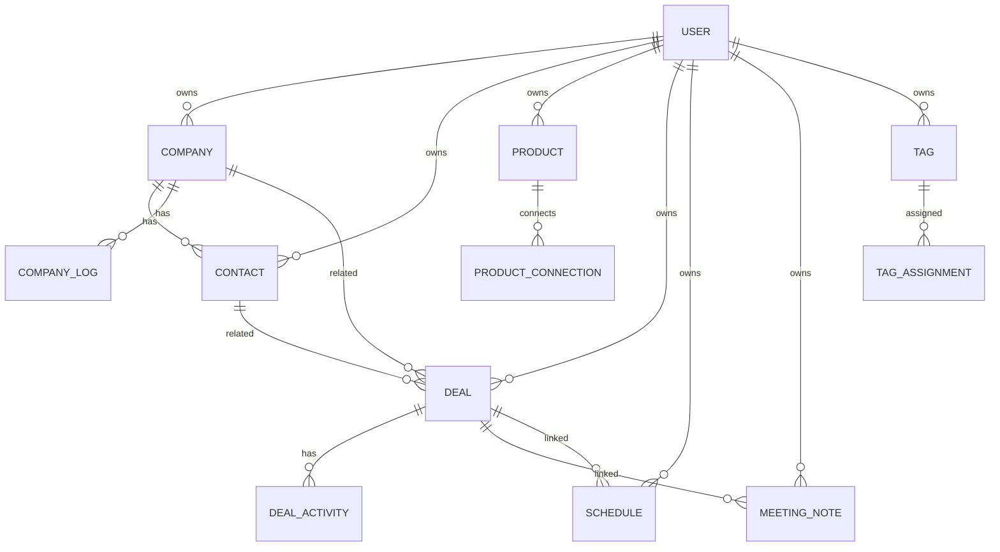

# 데이터 모델 / ERD 초안

> MVP는 명확한 영업 도메인 모델을 사용하되, 태그/메모/metadata/custom field로 확장성을 확보한다.

---

## 1. 핵심 엔티티

```text
User
  ├─ Company
  │   ├─ CompanyLog
  │   └─ Contact
  │       └─ ContactLog
  ├─ Product
  │   └─ ProductLog
  ├─ Deal
  │   └─ DealActivity
  ├─ Schedule
  ├─ MeetingNote
  ├─ Tag
  └─ ImportJob / ExportJob / AuditLog / Notification
```

## 2. 공통 필드 원칙

대부분의 사용자 데이터 테이블은 다음 필드를 가진다.

- id
- userId
- createdAt
- updatedAt
- deletedAt
- metadata

확장 필드는 DB 구조에는 준비하되 MVP UI에서는 숨긴다.

## 3. User

- id
- email
- displayName
- role: USER / ADMIN
- authProvider
- createdAt
- updatedAt

## 4. Company

- id
- userId
- name
- location
- industry
- description
- metadata
- deletedAt

관계:

- Company 1:N Contact
- Company 1:N CompanyLog
- Company N:M Product through ProductConnection
- Company 1:N Deal
- Company 1:N Schedule
- Company 1:N MeetingNote

## 5. CompanyLog

- id
- userId
- companyId
- logDate
- title
- content
- createdAt
- updatedAt
- deletedAt

목적:

- 회사 자체 연혁/히스토리/변경 내역 기록

## 6. Contact

- id
- userId
- companyId nullable
- name
- department
- position
- location nullable
- phone
- email
- metadata
- deletedAt

관계:

- Contact N:1 Company
- Contact N:M Product through ProductConnection
- Contact 1:N Deal
- Contact 1:N ContactLog
- Contact 1:N Schedule
- Contact 1:N MeetingNote

## 7. ContactLog

- id
- userId
- contactId
- logDate
- title
- content
- createdAt
- updatedAt
- deletedAt

목적:

- 거래처에 대해 확인된 객관적 만남/변경/소식/이력 기록

## 8. Product

- id
- userId
- name
- category
- description
- unitPrice nullable
- metadata
- deletedAt

관계:

- Product N:M Company/Contact/Deal through ProductConnection
- Product 1:N ProductLog

## 9. ProductLog

- id
- userId
- productId
- logDate
- title
- content
- createdAt
- updatedAt
- deletedAt

목적:

- 제품에 대해 확인된 객관적 변경/소식/제안/이력 기록

## 10. ProductConnection

제품과 회사/거래처/딜의 연결 의미를 저장한다.

- id
- userId
- productId
- targetType: COMPANY / CONTACT / DEAL
- targetId
- connectionType
- note
- createdAt
- updatedAt
- deletedAt

기본 connectionType:

- INTERESTED
- DELIVERED
- PROPOSED
- COMPETITOR
- MAINTENANCE
- OTHER

## 11. Deal

- id
- userId
- companyId nullable
- contactId nullable
- title
- amount
- currency default KRW
- stage
- likelihoodStatus: POSITIVE / NEUTRAL / NEGATIVE
- likelihoodPercent nullable
- metadata
- deletedAt

기본 stage:

- INITIAL_CONTACT
- IN_DISCUSSION
- WON
- LOST

관계:

- Deal N:1 Company
- Deal N:1 Contact
- Deal N:M Product through ProductConnection
- Deal 1:N DealActivity
- Deal 1:N Schedule
- Deal 1:N MeetingNote nullable

## 12. DealActivity

- id
- userId
- dealId
- activityDate
- typeId
- title
- content
- isAutoGenerated
- metadata
- deletedAt

## 13. DealActivityType

- id
- userId nullable
- name
- isSystem
- createdAt

시스템 기본 타입:

- 기타 기록
- 전화
- 미팅
- 이메일
- 단계변경
- 회의록연결

## 14. Schedule

- id
- userId
- title
- startAt
- endAt
- allDay
- companyId nullable
- contactId nullable
- dealId nullable
- location
- memo
- source: INTERNAL / GOOGLE
- externalCalendarId nullable
- externalEventId nullable
- metadata
- deletedAt

## 15. MeetingNote

- id
- userId
- dealId nullable
- companyId nullable
- contactId nullable
- meetingDate
- companyName
- contactName
- department
- productName
- stageText
- detail
- futurePlan
- requiredAction
- rawInput
- aiOutput
- metadata
- deletedAt

## 16. Tag

- id
- userId
- name
- color
- createdAt
- updatedAt

## 17. TagAssignment

- id
- userId
- tagId
- targetType: COMPANY / CONTACT / PRODUCT / DEAL / SCHEDULE / MEETING_NOTE
- targetId

## 18. PersonalMemo

회사/거래처/제품/딜의 Memo는 각 엔티티의 단일 `memo` 필드가 아니라 Log처럼 여러 건 누적되는 기록형 데이터로 저장한다.

Log는 객관적 사실, 변경, 만남, 소식, 이력 기록이고 Memo는 사용자의 주관적 생각, 판단, 개인 참고 기록이다. Memo 원문은 민감정보 후보로 보고 암호화, Admin masking, 원문 조회 감사 정책을 적용한다.

객관 Log는 `CompanyLog`, `ContactLog`, `ProductLog`, `DealActivity`로 도메인별 분리한다. 사용자 개인 Memo Log는 `PersonalMemo`로 저장하되 `targetType`과 `targetId`로 회사/거래처/제품/딜을 분리한다.

- id
- userId
- targetType: COMPANY / CONTACT / PRODUCT / DEAL
- targetId
- memoDate
- title nullable
- contentCiphertext
- contentKeyVersion
- isSensitive
- createdAt
- updatedAt
- deletedAt

## 19. AuditLog

- id
- actorUserId
- action
- targetType
- targetId
- reason nullable
- metadata
- createdAt

민감 데이터 원문 조회는 반드시 AuditLog를 남긴다.

## 20. Notification

- id
- userId
- type
- channel
- targetType
- targetId
- scheduledAt
- sentAt nullable
- status
- metadata

## 21. ImportJob

- id
- userId
- targetType
- fileName
- status
- aiMapping
- resultSummary
- createdAt
- completedAt nullable

## 22. Mermaid ERD




