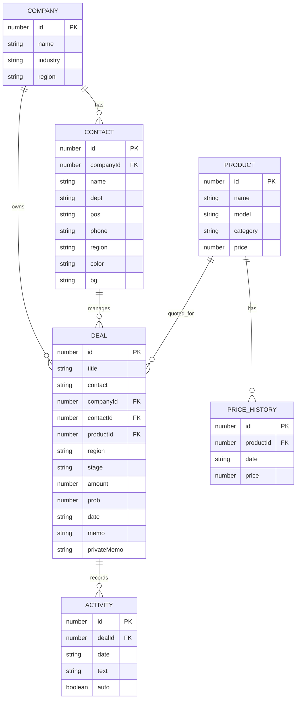

# SalesKit ERD 문서

## 1. 작성 기준

- 기준 문서: `docs/SalesKit_Planning.md`
- 구현 데이터: `src/data/mockData.ts`
- 목적: React 데모의 중앙 더미 데이터와 향후 DB 설계를 연결할 수 있도록 엔티티, 속성, 관계를 정리한다.

## 2. ERD 개요

## 3. 엔티티 상세

### 3.1 Company

고객사 마스터 데이터다. 회사 화면, 거래처 화면, 영업 건 목록에서 공통 참조된다.

| 컬럼 | 타입 | 키 | 설명 |
| --- | --- | --- | --- |
| id | number | PK | 회사 고유 ID |
| name | string |  | 회사명 |
| industry | string |  | 산업군 |
| region | string |  | 대표 지역 |

### 3.2 Contact

고객사 담당자 데이터다. 한 담당자는 하나의 회사에 소속된다.

| 컬럼 | 타입 | 키 | 설명 |
| --- | --- | --- | --- |
| id | number | PK | 담당자 고유 ID |
| companyId | number | FK | 소속 회사 ID |
| name | string |  | 담당자명 |
| dept | string |  | 부서 |
| pos | string |  | 직책 |
| phone | string |  | 전화번호 |
| region | string |  | 담당 지역 |
| color | string |  | 데모 아바타 텍스트 색상 |
| bg | string |  | 데모 아바타 배경 색상 |

### 3.3 Product

영업 건에서 견적 또는 제안 대상으로 연결되는 제품 마스터다.

| 컬럼 | 타입 | 키 | 설명 |
| --- | --- | --- | --- |
| id | number | PK | 제품 고유 ID |
| name | string |  | 제품명 |
| model | string |  | 모델명 |
| category | string |  | 제품 분류 |
| price | number |  | 현재 단가 |

### 3.4 PriceHistory

제품 단가 변경 이력이다. 현재 React 더미 데이터에서는 `Product.history` 배열로 포함되어 있지만, DB 설계에서는 독립 테이블로 분리한다.

| 컬럼 | 타입 | 키 | 설명 |
| --- | --- | --- | --- |
| id | number | PK | 단가 이력 고유 ID |
| productId | number | FK | 제품 ID |
| date | string |  | 변경일 |
| price | number |  | 기록 단가 |

### 3.5 Deal

영업 파이프라인의 핵심 엔티티다. 회사, 담당자, 제품을 참조한다.

| 컬럼 | 타입 | 키 | 설명 |
| --- | --- | --- | --- |
| id | number | PK | 영업 건 고유 ID |
| title | string |  | 영업 건명 |
| contact | string |  | 목록 표시용 거래처명 |
| companyId | number | FK | 고객사 ID |
| contactId | number | FK | 담당자 ID |
| productId | number | FK | 제품 ID |
| region | string |  | 지역 |
| stage | string |  | `prospect`, `negotiation`, `won`, `lost` |
| amount | number |  | 예상 금액 |
| prob | number |  | 수주 확도, 0-100 |
| date | string |  | 마감일 |
| memo | string |  | 일반 상담 메모 |
| privateMemo | string |  | 내부 참고 메모 |

### 3.6 Activity

영업 건별 활동 기록이다. 현재 React 더미 데이터에서는 `Deal.activities` 배열로 포함되어 있지만, DB 설계에서는 독립 테이블로 분리한다.

| 컬럼 | 타입 | 키 | 설명 |
| --- | --- | --- | --- |
| id | number | PK | 활동 기록 고유 ID |
| dealId | number | FK | 영업 건 ID |
| date | string |  | 활동 일자 |
| text | string |  | 활동 내용 |
| auto | boolean |  | 자동 생성 여부 |

## 4. 관계 정의

| 관계 | 카디널리티 | 설명 |
| --- | --- | --- |
| Company - Contact | 1:N | 한 회사는 여러 담당자를 가질 수 있다. |
| Company - Deal | 1:N | 한 회사는 여러 영업 건을 가질 수 있다. |
| Contact - Deal | 1:N | 한 담당자는 여러 영업 건을 담당할 수 있다. |
| Product - Deal | 1:N | 한 제품은 여러 영업 건에 연결될 수 있다. |
| Product - PriceHistory | 1:N | 한 제품은 여러 단가 변경 이력을 가진다. |
| Deal - Activity | 1:N | 한 영업 건은 여러 활동 기록을 가진다. |

## 5. 구현 메모

- React 데모에서는 더미 데이터를 `src/data/mockData.ts` 한 곳에 중앙화했다.
- UI 계산값인 회사별 담당자 수, 회사별 영업 건 수, 거래처별 영업 건 수는 저장하지 않고 배열 관계로 계산한다.
- 향후 DB 연동 시 `Deal.contact`는 중복 표시명으로 남기기보다 `companyId`, `contactId` 기반 표시로 대체하는 것이 적절하다.
- `date`는 현재 문서와 데모 호환을 위해 `YYYY.MM.DD` 문자열을 사용하지만, 실제 DB에서는 `date` 타입 또는 ISO 문자열 사용을 권장한다.
